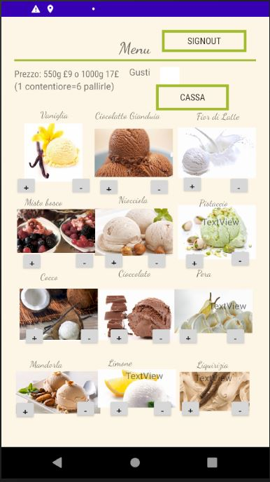
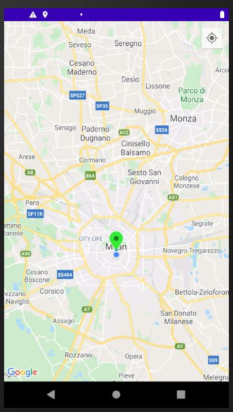
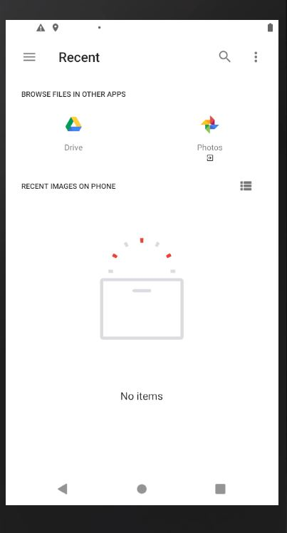

# eScoop
## General info
The goal is to create an android app that handles online orders with multi‑functionalities that include location‑detection,image storage/retrieval, various authen‑
tication methods, push notification and offline cache..
## Features
This is menu function where the customers can place the orders 

 

This is the google map extension to get the current location used for delivery address

  

This is the extension used as a upload function for the coupon which applies deduction in the total price.

   

## Technologies
Java SE 15
Android Studio 4.2.2
